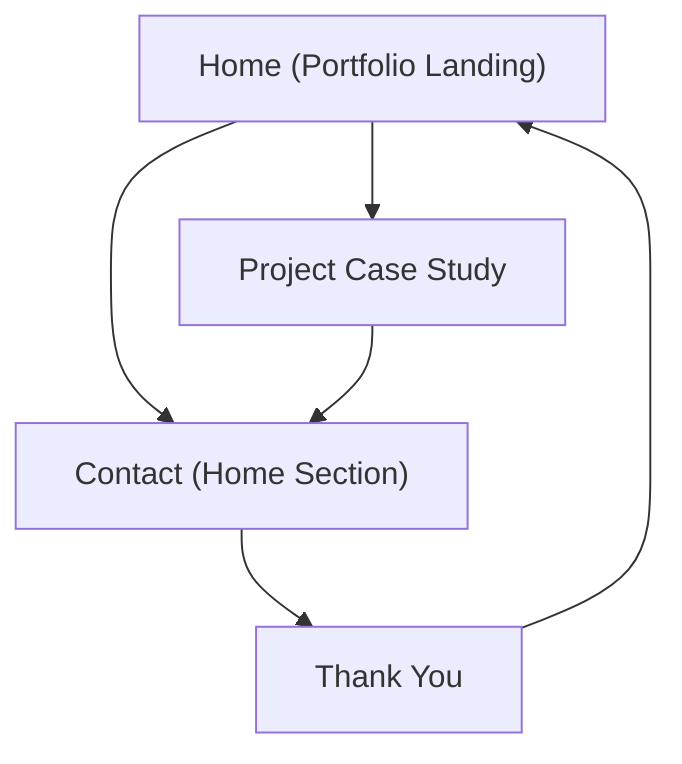

## 1. Product Overview
A conversion-focused frontend developer portfolio that communicates value fast and drives visitors to contact you.
Dark-first, responsive, and polished with smooth Framer Motion animations using Next.js App Router.

## 2. Core Features

### 2.1 Feature Module
The portfolio requirements consist of the following main pages:
1. **Home (Portfolio Landing)**: header navigation, hero + primary CTA, key sections (services, work, process, skills/stack, about, testimonials, FAQ), contact section with form.
2. **Project Case Study**: deep project story, outcomes, gallery, tech stack, and CTA back to contact.
3. **Thank You**: confirmation state after successful contact submission + next steps.

### 2.2 Page Details
| Page Name | Module Name | Feature description |
|-----------|-------------|---------------------|
| Home (Portfolio Landing) | Header / Navigation | Navigate to sections (Work, Services, Process, About, Contact); highlight primary CTA (e.g., “Hire me / Let’s talk”). |
| Home (Portfolio Landing) | Hero + Primary CTA | Communicate role + niche; show 1–2 CTAs (primary: contact; secondary: view work); support with brief proof points. |
| Home (Portfolio Landing) | Social Proof | Show testimonials and/or client logos; link to relevant work if available. |
| Home (Portfolio Landing) | Services / Value Props | Explain what you deliver (e.g., landing pages, design-to-code, performance); clarify outcomes and engagement fit. |
| Home (Portfolio Landing) | Featured Work | Display selected projects as cards; allow click-through to case study page. |
| Home (Portfolio Landing) | Process | Explain steps from discovery to delivery; set expectations and reduce friction. |
| Home (Portfolio Landing) | Skills / Tech Stack | Present core technologies and strengths relevant to frontend work; keep scannable. |
| Home (Portfolio Landing) | About | Provide concise background, differentiators, and working style; reinforce credibility. |
| Home (Portfolio Landing) | FAQ | Answer common objections (availability, pricing model, timeline, communication). |
| Home (Portfolio Landing) | Contact | Capture inquiry via form (name, email, message); include alternate contact links; validate inputs; show success/failure states. |
| Project Case Study | Case Study Content | Present problem, your role, approach, solution, results; include media/gallery; highlight key learnings. |
| Project Case Study | CTA to Contact | Provide sticky or inline CTA back to Home contact section (or open contact). |
| Thank You | Confirmation + Next Steps | Confirm receipt; provide expected response time; offer link back to work or home. |

## 3. Core Process
**Visitor Flow**: You land on Home → skim Hero/Services/Proof → open Featured Work → read a Case Study → return to Contact → submit inquiry → see Thank You confirmation.

