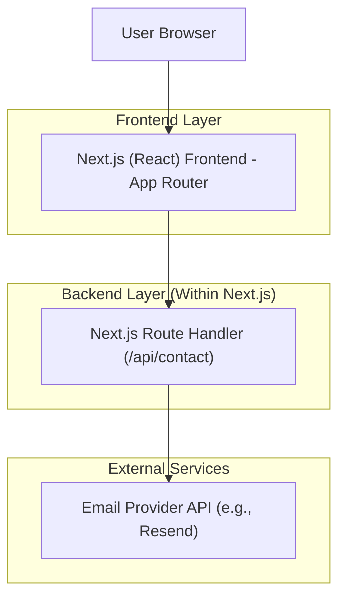
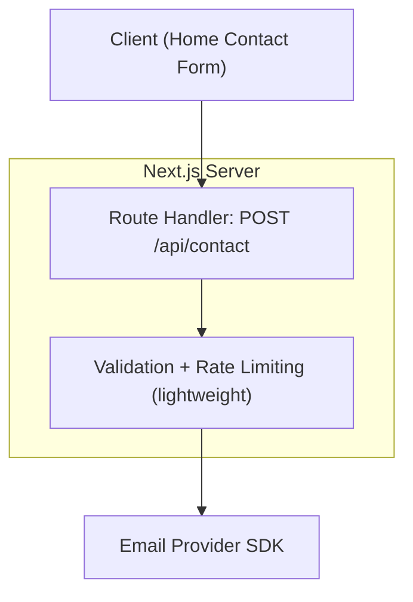

## 1.Architecture design


## 2.Technology Description
- Frontend: Next.js@15 (App Router) + React@19 + TypeScript + tailwindcss@4
- Animations: framer-motion
- Backend: Next.js Route Handlers (only for secure contact submission)

## 3.Route definitions
| Route | Purpose |
|-------|---------|
| / | Home portfolio landing with all conversion sections |
| /projects/[slug] | Project case study page |
| /thank-you | Confirmation after contact submit |

## 4.API definitions (If it includes backend services)
### 4.1 Core API
Contact form submission
```
POST /api/contact
```

Request (JSON):
| Param Name | Param Type | isRequired | Description |
|-----------|------------|------------|-------------|
| name | string | true | Sender name |
| email | string | true | Sender email |
| message | string | true | Inquiry details |
| contextUrl | string | false | Page URL / referral context |

Response (JSON):
| Param Name | Param Type | Description |
|-----------|------------|-------------|
| ok | boolean | Whether send succeeded |
| error | string | Present only on failure |

TypeScript shared types
```ts
export type ContactRequest = {
  name: string;
  email: string;
  message: string;
  contextUrl?: string;
};

export type ContactResponse =
  | { ok: true }
  | { ok: false; error: string };
```

## 5.Server architecture diagram (If it includes backend services)

